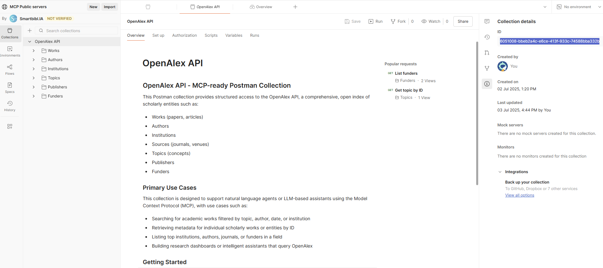

# Postman to MCP Server CLI Tool

---

## Overview

**Postman2MCP** is a CLI tool that automates the process of:
- Harvesting a Postman collection from your Postman account,
- Converting it to an OpenAPI 3.1 specification,
- Generating a ready-to-use Python project with a FastAPI proxy and a FastMCP server,
- Providing scripts for local development and public exposure via Ngrok.

This tool is ideal for quickly scaffolding an MCP-compatible API proxy from any Postman collection.

---

## Table of Contents

1. [Installation](#installation)
2. [Usage](#usage)
    - [Command Syntax & Arguments](#command-syntax--arguments)
    - [How to Find Your Postman Collection ID](#how-to-find-your-postman-collection-id)
    - [How to Get a Postman API Key](#how-to-get-a-postman-api-key)
    - [How to Get an Ngrok Auth Token](#how-to-get-an-ngrok-auth-token)
    - [Example Usage](#example-usage)
3. [Project Structure](#project-structure)
4. [Example repository: openalex-postman2mcp](#example-repository)
5. [License](#license)

---

## Installation

### Prerequisites

- Python 3.7 or later
- Git (for installing from GitHub)
- A [Postman](https://www.postman.com/) account with a Postman API key
- Optional: an [Ngrok](https://ngrok.com/) account (for public tunneling)

### Installation Steps

1. **Install the CLI Tool**  
   It is recommended to use a virtual environment:
   ```sh
   python -m venv .venv
   .venv\Scripts\activate  # On Windows
   source .venv/bin/activate  # On Linux/Mac
   pip install git+https://github.com/gegedenice/postman2mcp.git
   ```

2. **Verify Installation**
   ```sh
   postman2mcp --help
   ```

---

## Usage

The CLI provides a simple interface to generate a FastAPI+MCP project from a Postman collection.

### Command Syntax & Arguments

```sh
postman2mcp --collection-id <POSTMAN_COLLECTION_ID> \
            --project-dir <PROJECT_DIR> \
            --postman-api-key <POSTMAN_API_KEY> \
            --ngrok-authtoken <NGROK_AUTHTOKEN>
```

**Arguments:**

- `--collection-id` (required):  
  The unique ID of your Postman collection.  
- `--project-dir` (optional, default: `my-mcp-project`):  
  Directory where the project will be generated.
- `--postman-api-key` (required):  
  Your Postman API key (see below for how to obtain).
- `--ngrok-authtoken` (optional):  
  Your Ngrok authentication token (see below for how to obtain).

---

## Recommendations for Creating Your Postman Collection

1. **Think Like an LLM:** When designing your Postman collection, always consider what information would be most useful for a large language model (LLM) to understand and utilize your API. Include all relevant details, context, and clarifications that could help an LLM generate accurate and helpful responses. Anticipate the kinds of questions or tasks an LLM might be asked to perform using your API, and ensure the collection provides the necessary information.

2. **Thorough Documentation:** Document every route and request in your collection with clear, comprehensive descriptions. Explain the purpose, expected inputs, outputs, and any edge cases or special behaviors. Well-documented collections are much easier for both humans and LLMs to interpret and use effectively.

3. **Diverse and Multiple Examples:** For each route, provide multiple and diverse example requests and responses. This helps LLMs (and users) understand the full range of possible interactions with your API, including typical, edge, and error cases. The more varied your examples, the better the LLM can generalize and assist with real-world usage scenarios.

You can have a look as an example to [https://www.postman.com/smartbiblia/mcp-public-servers/collection/dfbn6uv/openalex-api](https://www.postman.com/smartbiblia/mcp-public-servers/collection/dfbn6uv/openalex-api)

---

### How to Find Your Postman Collection ID

1. By the Postman API to list your collections
```
https://api.getpostman.com/collections?apikey={{postman-api-key-here}}
```
2. By viewing Info on the right sidebar



---

### How to Get a Postman API Key

1. Log in to [Postman](https://web.postman.co/).
2. Click your profile icon (top right) → **Account Settings**.
3. Go to the **API Keys** tab.
4. Click **Generate API Key**, give it a name, and copy the key.

---

### How to Get an Ngrok Auth Token

1. Sign up or log in at [ngrok.com](https://dashboard.ngrok.com/).
2. Go to **Your Authtoken** in the dashboard.
3. Copy the token string.

---

### Example Usage

```sh
postman2mcp --collection-id bbeb2a4c-e6ce-413f-933c-74588bba332b \
            --project-dir my-mcp-project \
            --postman-api-key PMAK-xxxxxxxxxxxxxxxxxxxxxxxxxxxxxxxx \
            --ngrok-authtoken 2Nxxxxxxxxxxxxxxxxxxxxxxxxxxxxxxxxxxxx
```

Then navigate to your project directory:

```sh
cd ./my-mcp-project
```

**Follow the generated `README.md` in your project for next steps (install dependencies, run servers, etc).**

---

## Project Structure

The generated project will look like:

```
/path/to/project/
├── fastapi_proxy/
│   ├── main.py
│   ├── postman_collection.json
│   └── openapi.json
├── .env
├── server.py
├── ngrok_tunnel.py
├── requirements.txt
└── README.md
```

- **fastapi_proxy/**: contains the FastAPI proxy server and API specs.
  - **main.py**: the main file for the FastAPI proxy server.
  - **openapi.json**: the converted OpenAPI 3 specification.
  - **postman_collection.json**: the harvested Postman collection.
- **.env**: stores your API keys and tokens.
- **server.py**: FastMCP server entry point.
- **ngrok_tunnel.py**: script to expose your MCP server via Ngrok.
- **requirements.txt**: python dependencies.
- **README.md**: Project-specific instructions.

---

## Todo

- Better manage logging messages
- Add polite tool in Postman collection
- Generate a Dockerfile to run a MCP container

## Example repository: openalex-postman2mcp

See this GitHub repository [https://github.com/gegedenice/openalex-postman2mcp](https://github.com/gegedenice/openalex-postman2mcp) to have an example of generated MCP server on the OpenAlex API.

## License

This project is licensed under the MIT License. See the LICENSE file for details.

---

Thank you for using **Postman2MCP**!  
If you have questions or need help, please open an issue on the [GitHub repository](https://github.com/gegedenice/postman2mcp).